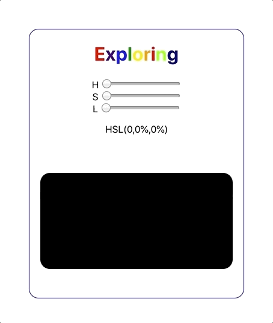

# React Color-Picker

## Description

A Javascript Color-Picker app using state management in react.

https://StPeteFrank-ColorPicker.surge.sh

- JavaScript. A scripting or programming language that allows you to implement complex things on web pages — every time a web page does more than just sit there and display static information for you to look at — displaying timely content updates, interactive maps, animated 2D/3D graphics, scrolling video jukeboxes, etc. — you can bet that JavaScript is probably involved.

https://www.javascript.com/

- React. A declarative, efficient, and flexible JavaScript library for building user interfaces. It lets you compose complex UIs from small and isolated pieces of code called “components”.

https://reactjs.org/
